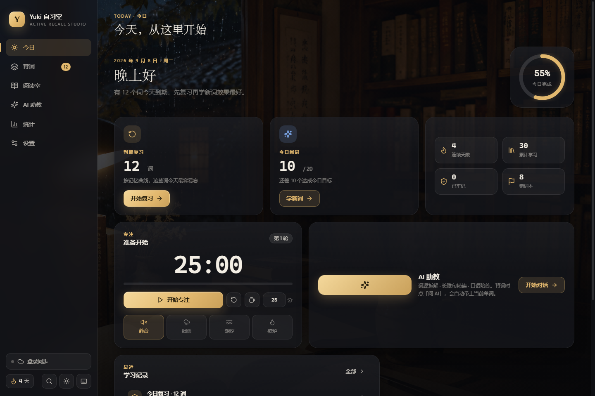

# Yuki 自习室

> 主动回忆 · 间隔重复 · AI 语境阅读 —— 一个安静、好看、真的能帮你记住单词的英语自习室。

在线地址：https://suki0201.cc.cd



## 它是怎么帮你记住的

1. **先回忆，再翻牌**：卡片正面只给中文释义和挖空例句，你先拼写（或默背、或听写），再看答案。
2. **每个词都有自己的记忆曲线**：评「忘了 / 模糊 / 记住 / 秒杀」后，SM-2 算法决定这个词下次什么时候回来（1 天、3 天、10 天……最长一年）。按钮上直接写着预告。
3. **每天打开就知道要做什么**：首页告诉你今天有多少词到期、新词学了几个、连续几天，一个按钮开始。
4. **错词自动归集**：评过「忘了」的词进错词本，可以单独刷，也能一键生成成短文。
5. **在语境里再见一次**：阅读室把刚背的词织进一篇短文；没配 AI 时用词库真实例句串读，配了 AI 就生成原创文章。点文中高亮词查词。
6. **随时问 AI**：背词时点「问 AI」自动带上当前单词；阅读室可以让 AI 精读整篇；助教支持长难句拆解、作文批改、雅思口语模拟、出题测验。

其他：番茄钟 + 细雨/潮汐/壁炉环境声、20 周热力图与趋势统计、全键盘操作、夜读黑金 / 日光纸墨双主题、PWA 可安装离线使用、多设备云同步。

## 本地运行

```bash
npm install
npm run serve          # 构建到 public/ 并在 http://localhost:3000 启动（含同步与代理接口）
```

或者只看前端：任何静态服务器指向项目根目录即可（例如 VS Code Live Server）。

## 部署到 Cloudflare

```bash
npx wrangler login
npm run deploy
```

`wrangler.toml` 已绑定 KV 命名空间 `LEXORA_KV` 与自定义域。可选环境变量：

| 变量 | 作用 |
| --- | --- |
| `PROXY_ALLOWED_HOSTS` | 逗号分隔的模型接口域名白名单；不设则允许任意公网 https 域名 |

## AI 服务配置

「设置 → 模型接口」填写任意 OpenAI 兼容接口（NVIDIA NIM、OpenAI、DeepSeek、DashScope、硅基流动、Moonshot 等有一键预设），点「检测模型」自动列出可用模型，「发一句试试」验证连通。

- 密钥只保存在当前浏览器，不会上传到云端，也不会进入备份文件。
- 线上环境的请求经 Worker 同源代理转发（规避浏览器跨域），密钥只在请求头中透传，不落盘。

## 账号与同步的安全设计

- 密码在浏览器内用 PBKDF2-SHA256（20 万轮，用户名作盐）派生出 `authKey` 后再发送，服务端永远拿不到明文。
- 服务端只保存 `SHA-256(随机盐 + authKey)`，每个用户独立随机盐。
- 登录 token 30 天过期，退出登录会在服务端吊销；登录失败 12 次后限流 15 分钟。
- 同步上传的数据在客户端和服务端都会剔除 API 密钥与登录凭证。
- 旧版（1.x）账号首次登录会自动升级到新方案。

## 项目结构

```
index.html              应用外壳
css/                    tokens（变量与主题）/ base / components / views
js/main.js              入口
js/core/                storage（数据层与迁移）· srs（间隔重复）· lexicon · api · sync · crypto · audio
js/ui/                  dom 工具 · router · overlay（抽屉/弹窗）· theme
js/features/            home · learn · reading · chat · stats · settings · study-engine
js/data/lexicon.js      内置词库（4532 词，动态加载）
server/cloudflare-worker.js   Workers 服务端（静态托管 + 账号 + 同步 + 模型代理）
server/sync-server.js         零依赖 Node 版，本地或自建服务器同协议
scripts/                build · selfcheck（核心与 Worker 自检）· browser-check / browser-flow（无头浏览器截图与端到端）
```

## 自检

```bash
npm run check           # SRS / 存储迁移 / 学习引擎 / Worker 鉴权、同步、代理
npm run serve           # 另开终端
npm run check:browser   # 逐页截图 + 收集控制台错误 → _archive/screens/
npm run check:flow      # 端到端：背完一轮、注册登录同步、离线短文、查词……
```

## 数据说明

本地数据存于 `localStorage`（`yuki.data.v2`），包含学习记录、每个单词的记忆状态、每日日志与偏好。1.x 的数据会在首次打开时自动迁移：历史打卡的词全部转成复习卡。

## 致谢

图标来自 [Lucide](https://lucide.dev)。词库整理自公开的 CET-4 词表。MIT License。
